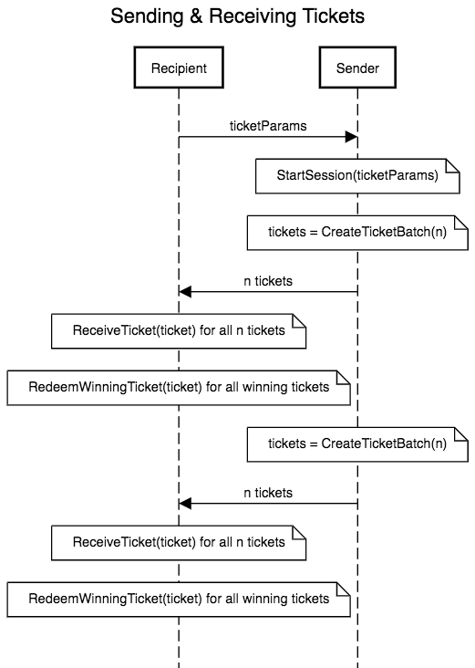

# Probabilistic Micropayments (PM) Client

The `pm` package contains a client implementation of the [Livepeer PM protocol](https://github.com/livepeer/wiki/blob/master/spec/streamflow/pm.md). The main areas of interest are:

- A `Ticket` type which defines the ticket format that both senders and recipients accept.
- A `Sender` type which is responsible for creating tickets.
- A `Recipient` type which is responsible for validating/receiving tickets and redeeming winning tickets using the `TicketBroker` interface (implemented by an Ethereum smart contract). This type will be able to translate a `Ticket` type into the correct format expected by the `TicketBroker`

In practice, the package user will need to define a communication channel (i.e. HTTP connection) and a network message format (i.e. protocol buffer) that peers will use to send and receive tickets. The sending peer will use the `Sender` type and the receiving peer will use the `Recipient` type.

## High Level Flow



[Sequence Diagram Source](https://sequencediagram.org/index.html#initialData=C4S2BsFMAIGVIHYBMQIObQGTQEqQMaQgBuqGAKiPgNaTADOAUI3viAA4iLAC0AfPGSQATgC5ooGnQAKAQ2GyAtk0YIA9sBhriIuIiQjxsYPODx69EGoQAKSbWByFygJTN1m6Nt2CDYiVQO9NAAvNAAwsKQspqUUsAAQjH4ABY2CG6Mvrr8uAQcXAjA4ggB8SoeWjrCeWyc3OKsRDpxDnaBdC7QAGZqNbLg4NCl9nQVGlW6rAUNeQaQigDqqAhkrXTt8V29-YPQAO4rZGVB7hNe1XpC-qMMoRFRMZDriclpGczZNbnT9UUlJzGZ083hqv0KxVqzWeHWAmwc2z60AGQxGsPGIMu4NmeHmSyO6Be8M6PSRKIOBIwt3oQA)

## RNG

A `Sender` and a `Recipient` execute a collaborative commit-reveal protocol in order to generate the random number used to determine if a ticket won or not. The random number construction is:

```
keccak256(abi.encodePacked(senderSig, recipientRand))
```

The `abi.encodePacked()` Solidity built-in is used to match the behavior of the contract implementing the `TicketBroker` interface. `senderSig` is a signature produced by `Sender` over the hash of the ticket and `recipientRand` is the pre-image of the `recipientRandHash` that is included in the ticket.

Before a `Sender` can start creating and sending tickets, it must first fetch ticket parameters from a `Recipient`. When generating ticket parameters, a `Recipient` will generate a random number `recipientRand`, compute the hash of `recipientRand` as `recipientRandHash` and include the hash with the ticket parameters. Once a `Sender` has a set of ticket parameters with a `recipientRandHash`, the `Sender` will use a monontonically increasing `senderNonce` with each new ticket that it creates.

The following conditions are met in order to ensure that the random number generation for winning ticket selection is fair:

- Once a `Sender` has a set of ticket parameters with a `recipientRandHash`, the `Sender` will use a montonically increasing `senderNonce` with each new ticket that it creates. The montonically increasing `senderNonce` will ensure that `senderSig` is unpredictable to the `Recipient`.
- Whenever a `Recipient` receives a ticket that uses a particular `recipientRandHash`, it will update an in-memory `lastSeenSenderNonce` for the `recipientRandHash`. If the `Recipient` ever receives a ticket with a `senderNonce` that is less than `lastSeenSenderNonce` it will consider the ticket a replay attack where the `Sender` is reusing an old `senderNonce`
- Whenever a `Recipient` redeems a winning ticket, it will store the `recipientRand` that corresponds to the ticket's `recipientRandHash` in-memory and if it receives a ticket with the same `recipientRandHash`, it will consider the ticket a replay attack where the `Sender` is reusing an old `recipientRandHash` that has an already revealed pre-image (because the ticket was already submitted to a contract) [1]

[1] Note: The `Recipient` type supports a max unacceptable error counting mechanism that provides a grace period for this type of replay because a `Sender` may not receive updated ticket parameters with a new `recipientRandHash` immediately after the `Recipient` redeems a winning ticket - in this case, the `Sender` might send a ticket with the old `recipientRandHash`.

See the [Livepeer protocol spec](https://github.com/livepeer/wiki/blob/master/spec/streamflow/pm.md) for more information on the specifics of the random number generation for winning ticket selection.